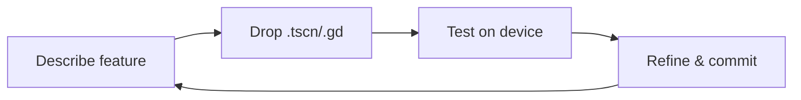

# 🎉 Neoshop – Planning Mode **COMPLETE** ✅

Offline-first shopping list for family & friends.  
Built with **Godot 4.4.1 + GDScript + SQLite GDExtension 4.5**.

---

## ✨ **What's New in This Release**

### 🔄 **Database Magic**
- **Sequential migration system** (v0 → v1 → v2)
- **Android persistence** solved (no permissions needed)
- **Schema evolution** with proper version tracking

### 🛠️ **Core Features**
- ✅ **Full CRUD** items + categories
- ✅ **Real-time search** across name/description/category
- ✅ **Category filter** dropdown (All + specific)
- ✅ **Long-press editing** (0.6s timer)
- ✅ **Material theme** responsive across phone/tablet/desktop

### 🌱 **Enhanced Seeding**
- **Progress dialog** during seeding
- **8 categories** + **8 items** pre-loaded
- **Category relationships** working perfectly

---

## 🚀 **Quick Start**

```bash
# 1. Clone
git clone [repo-url]
cd neoshop

# 2. Open in Godot 4.4+
godot project.godot

# 3. Run → seed data auto-inserted
# 4. Press "Add" or long-press items to edit
```

---

## 📱 **Android Ready**

```bash
# Build APK
godot --export-release Android
# Database persists across installs ✅
```

---

## 🎯 **Live Development Flow**

We iterate **live** in chat sessions:



---

## 📋 **Current Status**

| Feature | Status |
|---------|--------|
| Planning Mode | ✅ Complete |
| Category Management | ✅ Complete |
| Database Migration | ✅ v0→2 Working |
| Android Persistence | ✅ Solved |
| Shopping Mode | 🔄 Next Milestone |
| Multi-list Support | 🔄 Future |

---

## 🗂️ **Key Files**
- `res://db/migration.gd` - Database evolution
- `res://scripts/seed_manager.gd` - Enhanced seeding
- `res://ui/category_editor.tscn` - Category CRUD
- `res://ui/PlanningScreen.tscn` - Main interface

---

**Ready for M2 Android deployment!** 🚀
