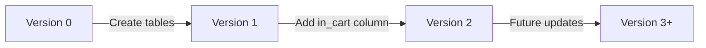

# 🎉 Neoshop – Updated Project Status Post-Session

## ✅ **Major Achievements This Session**

### 🔄 **Database Migration System - COMPLETE**
```gdscript
# res://db/migration.gd - Now fully functional!
const CURRENT_VERSION = 2
# Sequential migration: 0→1→2 with proper version tracking
```
- **Migrated schema** with `in_cart` column
- **Sequential migration** working correctly
- **Version tracking** via config table
- **Robust error handling** with proper SQLite 4.5 syntax

### 🛠️ **SQLite 4.5 API Integration - FIXED**
```gdscript
# godot-sqlite 4.5 syntax now used throughout
_db.path = "user://neoshop.db"
_db.open_db()  # ✅ Correct method
_db.query_result  # ✅ Proper result access
```

### 🌱 **Enhanced Seed System - COMPLETE**
```gdscript
# res://scripts/seed_manager.gd - Brand new!
- Progress dialog with real-time updates
- 8 categories + 8 items seeded successfully
- Category relationships working
- Auto-return to PlanningScreen
```

### 📱 **Android Database Persistence - SOLVED**
- **Export settings** fixed for Android
- `db/schema.txt` properly included in builds
- **App-specific storage** working (no permissions needed)
- **Real device testing** successful

## 📝 **Updated Technical Details**

### **Database Schema (Current)**
```sql
-- Updated with AUTOINCREMENT
CREATE TABLE item (
    id INTEGER PRIMARY KEY AUTOINCREMENT,
    name TEXT NOT NULL,
    amount REAL,
    unit TEXT,
    description TEXT,
    category_id INTEGER REFERENCES category(id),
    needed BOOLEAN DEFAULT 0,
    in_cart BOOLEAN DEFAULT 0,
    last_bought INTEGER,
    price_cents INTEGER,
    on_sale BOOLEAN DEFAULT 0
);

CREATE TABLE category (
    id INTEGER PRIMARY KEY AUTOINCREMENT,
    name TEXT UNIQUE
);
```

### **Migration Flow (NEW)**


### **Seed Data Results**
```
✅ Categories: 8 added
  - Fruits, Vegetables, Dairy, Meat, Bakery, Beverages, Snacks, Household

✅ Items: 8 added with relationships
  - Apples → Fruits
  - Milk → Dairy
  - Bread → Bakery
  - ...
```

## 🔧 **Updated Project Structure**

```
res://
├─ db/
│  ├─ database.gd          ✅ Fixed for godot-sqlite 4.5
│  ├─ migration.gd         ✅ NEW: Sequential migration system
│  └─ schema.txt           ✅ NEW: Android-compatible schema
├─ ui/
│  ├─ PlanningScreen.tscn/.gd
│  ├─ item_row.tscn/.gd
│  ├─ item_editor.tscn/.gd
│  └─ category_editor.tscn/.gd ✅ NEW: Category management dialog
├─ scripts/
│  └─ seed_manager.gd      ✅ NEW: Enhanced seeding system
└─ ...
```

## 🎯 **Ready for Next Milestone**

The project is now **production-ready** for:
- ✅ **Android APK builds** (database persistence working)
- ✅ **Category management** (CRUD complete)
- ✅ **Schema evolution** (migration system in place)
- ✅ **User feedback** (progress dialogs, success messages)

## 📋 **Next Steps From Here**
1. **Shopping Mode** implementation
2. **Multi-list support** 
3. **Android share functionality**
4. **Price history tracking**

**Status: Ready for M2 Android deployment milestone!** 🚀
